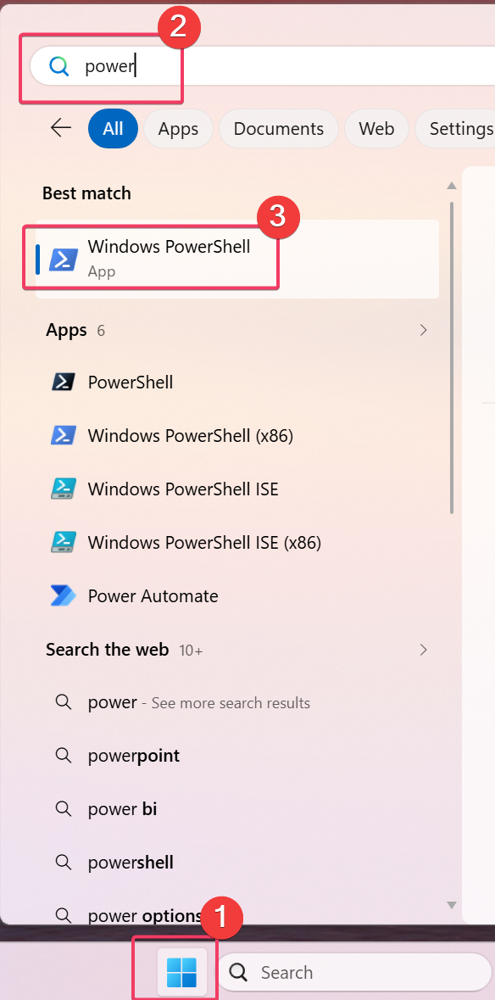
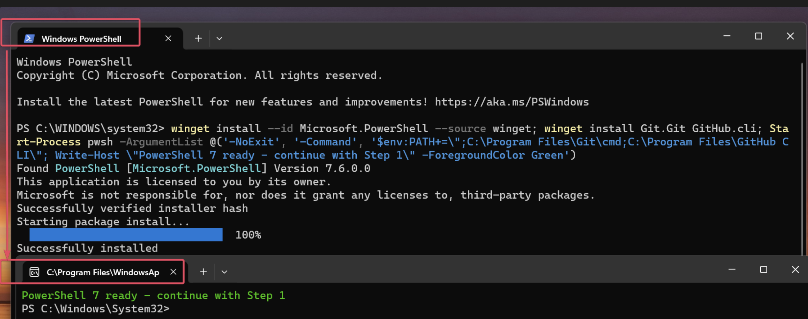
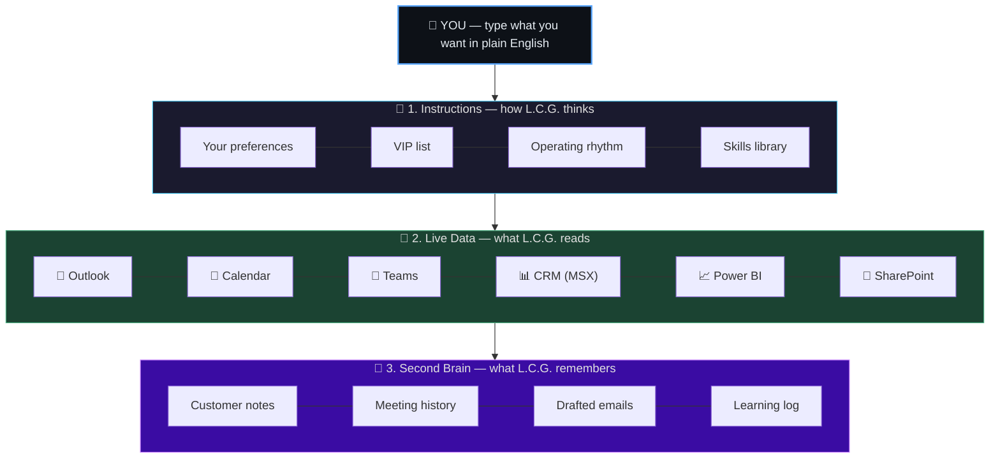
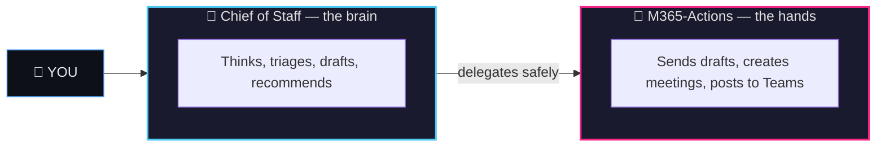

<p align="center">
  
</p>

# L.C.G.

### Let Copilot Grind

*Stop doing the grind yourself. Let Copilot do it.*

<br/>

[](https://nodejs.org/)
[](https://github.com/features/copilot)
[](https://modelcontextprotocol.io/)
[](#)

</div>

---

## Quick Start (5 Minutes)

Before you begin, make sure you have:

- [ ] **Microsoft corporate VPN** connected
- [ ] **Microsoft corp account** (e.g., `your-alias@microsoft.com`)
- [ ] **GitHub Copilot License** — [Get one here (Microsoft Internal)](https://aka.ms/copilot)

---

### Step 0: Install Prerequisites

> [!IMPORTANT]
> **Git, GitHub CLI, and (on Windows) PowerShell 7 are the only tools you need to install manually.** Everything else (VS Code, Node.js, Azure CLI) is handled by the bootstrap script in Step 2.

**macOS / Linux:**

```bash
brew install git gh
```

**Windows:**

1. Open **Windows PowerShell** from the Start menu (this is PowerShell 5 by default):

   

2. Paste the following single line into that terminal and press Enter:

   ```powershell
   winget install --id Microsoft.PowerShell --source winget; winget install Git.Git GitHub.cli; Start-Process pwsh -ArgumentList @('-NoExit', '-Command', '$env:PATH+=\";C:\Program Files\Git\cmd;C:\Program Files\GitHub CLI\"; Write-Host \"PowerShell 7 ready - continue with Step 1\" -ForegroundColor Green')
   ```

   This command installs all required dependencies — including PowerShell 7, Git, and GitHub CLI — and, once installation completes, automatically launches a new **PowerShell 7** window with the tools already on PATH (as shown below). Continue from that new window.

   

> [!NOTE]
> If you install Git or `gh` while VS Code is already open, **close and reopen VS Code entirely**. VS Code terminals inherit the system PATH from launch — newly installed tools won't be visible until you restart.

---

### Step 1: Clone and bootstrap

> [!IMPORTANT]
> Use your **personal GitHub account** (e.g. `JohnDoe`) when `gh auth login` prompts you. Do **NOT** use your Enterprise Managed User (EMU) account — the one ending in `_microsoft`. EMU accounts cannot access GitHub Packages from external organizations.

**macOS / Linux:**

```bash
git clone https://github.com/JinLee794/L.C.G.git && cd L.C.G && ./scripts/bootstrap.sh
```

**Windows (PowerShell 7 — the window opened in Step 0):**

```powershell
git clone https://github.com/JinLee794/L.C.G.git; cd L.C.G; Set-ExecutionPolicy -Scope CurrentUser -ExecutionPolicy RemoteSigned -Force; .\scripts\bootstrap.ps1
```

The bootstrap script installs Node.js 18+ (if missing), `npm install`s the project, configures GitHub Packages auth, scaffolds a local Obsidian vault at `.vault/`, writes a gitignored `.env`, and registers the `mcaps` CLI globally via `npm link`.

> [!IMPORTANT]
> **The bootstrap is interactive.** You will be prompted to:
> 1. Type `yes` to accept the AI / MCP security policy.
> 2. Sign in to GitHub via device code — press **Enter** in the terminal when prompted to open the browser, then paste the displayed code at <https://github.com/login/device>. Use your **personal** GitHub account, not an EMU (`*_microsoft`) account.
> 3. Press **Enter** to accept the default local vault path (or paste a path to an existing Obsidian vault).

> [!NOTE]
> **If you have an existing Node.js installation**, make sure it is up-to-date (v18+) so that `npx` works correctly. The bootstrap script installs Node if missing, but won't upgrade an existing outdated installation. Run `node --version` to check.

> [!TIP]
> Just want to check what's missing? Run with `--check-only` (macOS/Linux) or `-Check` (Windows) to see a report without installing anything.

### Step 2: Sign in to Azure

The MSX-CRM and WorkIQ MCP servers authenticate via Azure CLI. Install it if you don't already have it, then sign in:

```powershell
winget install --id Microsoft.AzureCLI --source winget   # Windows, first time only
az login
```

```bash
brew install azure-cli   # macOS, first time only
az login
```

### Step 3: Open the repo in VS Code

```powershell
code .
```

VS Code auto-starts the MCP servers declared in `.vscode/mcp.json`. Open **Copilot Chat** (`⌃⌘I` / `Ctrl+Alt+I`), select the **Chief of Staff** agent, and start typing.

**Optional — use the terminal CLI:**

The bootstrap registers `mcaps` globally via `npm link`. **Open a new terminal** (existing terminals don't yet have `%APPDATA%\npm` on PATH) and run:

```powershell
mcaps list               # see available automations
mcaps morning-triage     # run a task directly
```

> Both interfaces share the same agents, skills, and MCP servers.

---

## Why L.C.G. Exists

You already know the pain:

- **Hundreds of emails** — and you're manually deciding what matters before your first coffee
- **Back-to-back meetings** — prep means hunting across 5+ tools you didn't build and don't love
- **Same deliverables, every week** — rebuilt from scratch instead of compounding
- **Institutional memory** — trapped in your head, not in a system
- **Follow-ups everywhere** — scattered across email, CRM, Teams, and sticky notes

No single tool today reads across your M365 + CRM stack, remembers *your* priorities, and still lets you own every final call. So you grind. Every. Single. Day.

L.C.G. turns GitHub Copilot into the tireless junior staffer you always wanted — one that **pre-reads, pre-researches, and pre-drafts everything** so you can focus on judgment, relationships, and the work that actually needs a human.

---

## What You Get — Day One

Just type a command in Copilot Chat. No menus, no screens, no training required.

### ☀️ Every Morning

| Say this…                | …and get this                                                  |
| ------------------------ | -------------------------------------------------------------- |
| `/morning-triage`      | Prioritized daily brief: what's urgent, what can wait, who's waiting on you |
| `/meeting-brief`       | One-page prep for your next meeting — context, attendees, open items, risks |
| `/meeting-followup`    | Action items and next steps written for you after a meeting ends |
| `/update-request`      | Polished follow-up emails to customers who owe you an answer   |

### 📆 Every Week

| Say this…                | …and get this                                       |
| ------------------------ | --------------------------------------------------- |
| `/weekly-rob`          | Your rhythm-of-business summary, ready to send      |
| `/winning-wednesdays`  | Win-Room highlights condensed to what matters       |
| `/win-wire-digest`     | Big-deal recaps compiled for your team              |
| `/stu-highlights`      | Channel highlights you'd otherwise miss             |

### 🎯 On Demand

| Say this…                | …and get this                                                         |
| ------------------------ | --------------------------------------------------------------------- |
| "Review this opportunity" | Full deal deep-dive with recent signals, risks, and recommended next steps |
| "Run pipeline hygiene"   | Stale deals, missing fields, close-date drift — ranked by severity   |
| "Prep me for my 1:1"     | Seller's pipeline, recent movement, coaching opportunities            |
| "Build a deck on…"        | PowerPoint draft pulled from your vault + CRM data                    |

> **34+ skills** are bundled in. You never need to memorize names — just describe the outcome you want.

---

## How It Works (in plain English)

L.C.G. runs on three simple layers. You only ever interact with the first one.



| Layer | What it means for you |
| --- | --- |
| **1. Instructions** | Your style, your VIPs, your priorities — written in plain markdown. Edit anytime. |
| **2. Live Data** | One request, many systems read at once. No more tab-hopping. |
| **3. Second Brain** | L.C.G. remembers your customers, deals, and corrections. **It gets smarter every week.** |

### Two Agents — One Brain, One Set of Hands



The **brain** does all the thinking and never touches your inbox or Teams directly. The **hands** only act on scoped, approved instructions. If the brain wants to send a message, it hands off a draft — you approve before it leaves.

---

## You Stay in Control

Copilot grinds, but **nothing ships without you**.

| What L.C.G. does | What it won't do |
| --- | --- |
| ✅ **Drafts emails** in your voice | ❌ Never sends email without your review |
| ✅ **Prepares Teams messages** | ❌ Never posts without explicit approval |
| ✅ **Stages CRM updates** for review | ❌ Never writes to CRM silently |
| ✅ **Reads your vault** for context | ❌ Never syncs vault data to the cloud |
| ✅ **Logs every action** it takes | ❌ No surprise automation — ever |

> **Your data stays local.** Your vault lives on your machine. Your CRM credentials never leave your session. No external training. No "cloud memory." Just you and Copilot.

---

## What's Under the Hood

L.C.G. is built on four design principles that make it different from a chatbot:

| | Principle | Why it matters to you |
|---|---|---|
| 💬 | **Plain English config** | Change any behavior by editing a markdown file — no code, no IT ticket |
| 🏠 | **Local-first** | Your data never leaves your laptop |
| 🔀 | **Multi-signal** | One request cross-references email + calendar + CRM + your notes |
| 🔄 | **Self-correcting** | When you correct L.C.G., it remembers — and doesn't make the same mistake twice |

<details>
<summary><strong>Connected systems (for the curious)</strong></summary>

L.C.G. connects to your live enterprise data through a secure local bridge. One request reads from all of these at once:

| Category | Systems |
|---|---|
| 📧 **Communication** | Outlook Mail, Teams Chat, Teams Channels |
| 📅 **Scheduling** | Outlook Calendar, room booking |
| 📊 **CRM** | Microsoft Sales Experience (MSX) — opportunities, milestones, accounts |
| 📈 **Analytics** | Power BI — billed pipeline, consumption, SQL600, and more |
| 📁 **Files** | SharePoint, OneDrive, Word |
| 🗄️ **Memory** | Your local Obsidian vault |
| 🔍 **Search** | WorkIQ cross-M365 retrieval |

</details>

<details>
<summary><strong>Developer reference</strong></summary>

### Project structure
```
L.C.G/
├── .github/
│   ├── instructions/        ← behavior rules (triage, prep, CRM, comms)
│   ├── prompts/             ← workflow templates
│   ├── skills/              ← 34+ domain skills
│   └── agents/              ← agent definitions
├── scripts/                 ← automation helpers
├── vault-starter/           ← Obsidian vault templates
└── package.json
```

### MCP config
All live-data connections are declared in `.vscode/mcp.json`.

### npm scripts (optional, for headless runs)

| Command | Purpose |
| --- | --- |
| `npm run setup` | Verify prerequisites and configure local env |
| `npm run check` | Verify environment and workspace config |
| `npm run vault:init` | Bootstrap Obsidian vault from templates |
| `npm run morning:validate` | Validate morning brief output |
| `npm run meeting:validate` | Validate meeting brief |
| `npm run eval` | Run evaluation suite |

</details>

---

## Troubleshooting

### `npm ERR! 404 Not Found` or `401 Unauthorized` from `npm.pkg.github.com`

**What's happening:** Some MCP server packages (`@microsoft/msx-mcp-server`, `@jinlee794/obsidian-intelligence-layer`) are published to GitHub Packages, not the public npm registry. The project `.npmrc` already routes these scopes to the right place — but GitHub Packages requires a personal access token (PAT) for authentication, even for read-only access.

**Fix it in one step:**

```bash
npm login --registry=https://npm.pkg.github.com
```

When prompted:

- **Username:** your GitHub username
- **Password:** a personal access token (classic) with the `read:packages` scope
- **Email:** your GitHub email

That's it. The token is saved to your user-level `~/.npmrc` and applies everywhere.

<details>
<summary>Manual alternative (if <code>npm login</code> doesn't work)</summary>

1. Go to [github.com/settings/tokens](https://github.com/settings/tokens)
2. Click **Generate new token (classic)**
3. Select the **`read:packages`** scope
4. Copy the token
5. Open (or create) `~/.npmrc` and add this line:

```
//npm.pkg.github.com/:_authToken=ghp_YOUR_TOKEN_HERE
```

Replace `ghp_YOUR_TOKEN_HERE` with your actual token.

</details>

> **Why is this needed?** GitHub Packages doesn't support anonymous reads. The project-level `.npmrc` in this repo handles *which* packages go to GitHub vs. public npm — you just need to provide a token so GitHub lets you in.

### MCP server fails to start with `ERR_UNSUPPORTED_ESM_URL_SCHEME`

This usually means you're running a Node version older than 18. Check with `node --version` and upgrade if needed.

### `copilot CLI not found` when running automations

The task runner uses GitHub Copilot's CLI binary. It looks for it in:

1. `COPILOT_CLI_PATH` environment variable
2. `copilot` on your system PATH
3. VS Code's bundled location (`AppData/Code/User/globalStorage/github.copilot-chat/copilotCli/`)

Make sure GitHub Copilot Chat is installed in VS Code — it bundles the CLI automatically.

### Azure CLI token expired

CRM and M365 operations require an active Azure CLI session. If you see token errors:

```bash
az login
```

---

<div align="center">

*L.C.G. — Let Copilot Grind — Private repository — Internal use only*

</div>
